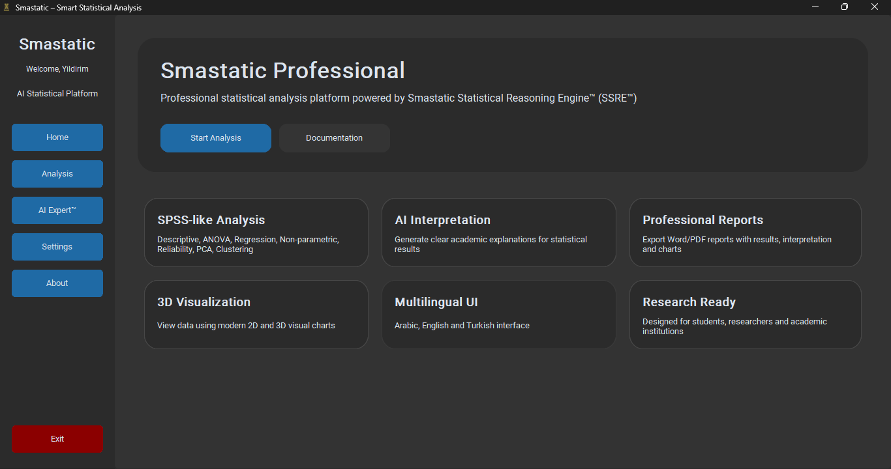
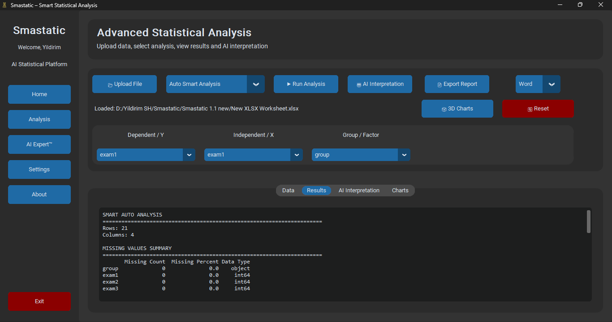
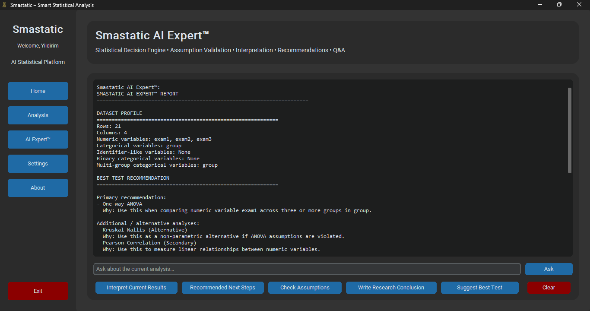
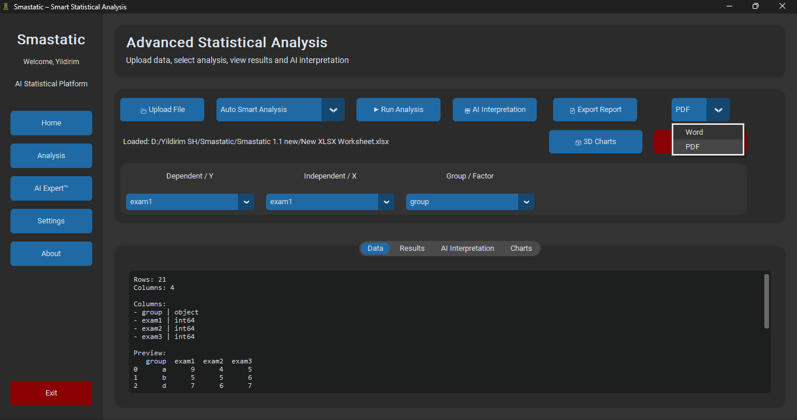

# Smastatic Professional™

Professional AI-powered statistical analysis platform designed for researchers, students, lecturers and academic institutions.

---

## Overview

Smastatic Professional™ is a desktop statistical analysis platform that automates statistical decision-making through its proprietary **Smastatic Statistical Reasoning Engine™ (SSRE™)**.

The system performs statistical assumption validation, automatic test selection, statistical analysis, academic interpretation and professional report generation within a single desktop application.

---

## Main Features

- Automatic Statistical Test Selection
- Statistical Assumption Validation
- SPSS-like Statistical Analysis
- Smastatic Statistical Reasoning Engine™ (SSRE™)
- Professional Academic Interpretation
- Word Report Export
- Interactive Statistical Charts
- Offline Desktop Application
- Local User Authentication
- English, Arabic and Turkish Interface

---

## Smastatic Statistical Reasoning Engine™ (SSRE™)

The proprietary SSRE™ engine performs:

1. Dataset Inspection
2. Statistical Assumption Validation
3. Automatic Statistical Test Selection
4. Statistical Analysis Execution
5. Academic Result Interpretation
6. Next Analysis Recommendation
7. Publication-ready Academic Conclusion Generation

---

## System Requirements

| Component | Requirement |
|-----------|-------------|
| Operating System | Windows 10 / Windows 11 |
| Processor | Intel Core i3 or higher |
| Memory | Minimum 4 GB RAM |
| Recommended Memory | 8 GB RAM |
| Storage | 100 MB Free Space |
| Internet | Required only for first account registration and account verification |

---

## Installation

1. Download the latest Release.
2. Extract the ZIP file.
3. Open the extracted folder.
4. Run **Smastatic.exe**.
5. Create your account.
6. Start statistical analysis.

---

## Screenshots

Screenshots are available inside the **screenshots** folder.

## Screenshots

### Welcome Page

### Home Page

### Analysis Page

### AI Expert Page

### Reports

---

## Developer

Inv. Yildirim Salahaldin Hussein
Academic and inventor who hold the (Inv.) – Certified Inventor from IFIA (Geneva) and globally to obtain a patent in artificial intelligence algorithms. Achieved significant research and practical contributions in artificial intelligence, LLM, applied statistics, and programming. First Iraqi, appointed in The International Society of Data Scientists ISODS as (Vice President) for Iraq with recognitions from IBM as Rising Champion, OpenAI, IEEE, ScoreDetect, and OriginStamp. Developer of impactful AI systems (Search, Eco Predict, Chot, Smastatic) and author of the book Research and Advanced Technology Centers and AI.
---

## Citation

If you use YILDO AI in research, publications, or academic work, please cite the software using the provided citation information.

DOI:
https://doi.org/10.5281/zenodo.21434718
---

## License

This project is distributed under the MIT License.

---

## Contact

GitHub:
https://github.com/Yildirimshh

LinkedIn:
https://iq.linkedin.com/in/inv-yildirim-s-h-492b65117

Google Scholar:
https://scholar.google.com/citations?user=9XP3qjYAAAAJ&hl=tr

ORCID:
https://orcid.org/0009-0007-7411-1503
